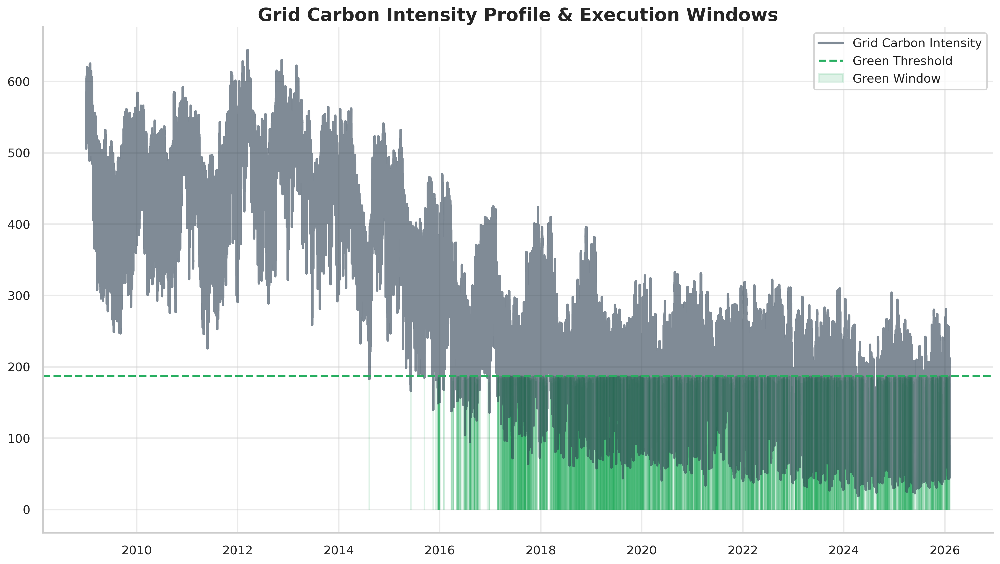
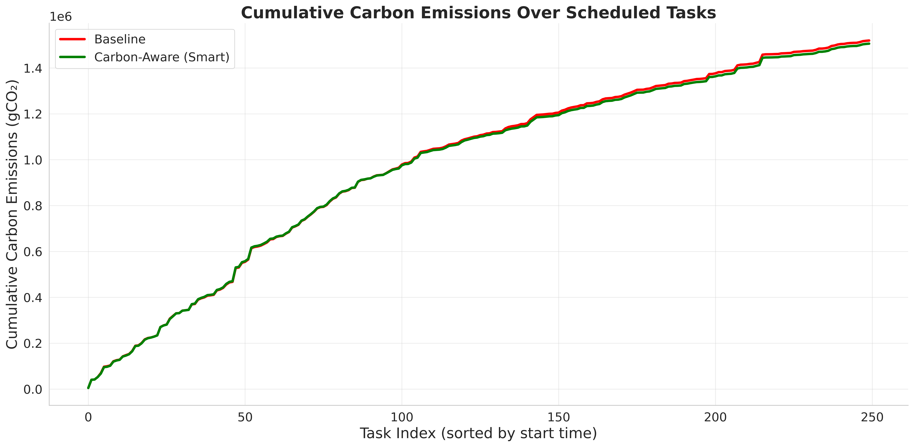
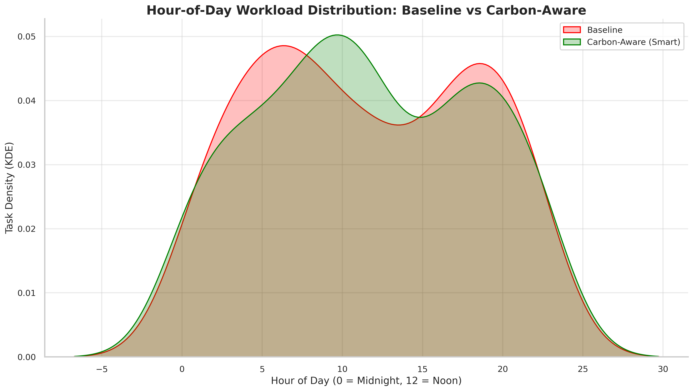

# Percentile-Based Threshold Scheduling (PBTS) for Carbon-Aware Datacenters

This repository contains the simulation code and dataset for evaluating a Carbon-Aware scheduling algorithm designed to reduce greenhouse gas emissions in cloud datacenters through the temporal shifting of delay-tolerant workloads.

## Project Overview
Modern datacenters often utilize Carbon-Blind scheduling (like First-Come-First-Serve), executing workloads immediately regardless of the local power grid's carbon intensity. 

This research proposes a **Percentile-Based Threshold Scheduler (PBTS)** that dynamically identifies low-carbon "Green Windows" using empirical data from the UK National Grid ESO. By temporally shifting delay-tolerant batch jobs into these windows, the algorithm reduces total absolute carbon emissions without violating Service Level Agreements (SLAs) or compromising computational throughput.

## Methodology & Architecture
* **Empirical Data:** Utilizes half-hourly carbon intensity metrics (gCO2/kWh) from the UK National Grid Data Portal (CKAN).
* **Robust Pre-processing:** Implements a custom data cleaner utilizing Z-score outlier detection to handle real-world sensor anomalies.
* **Stochastic Workload Generation:** Simulates authentic datacenter traffic using Poisson arrival processes and Exponential distributions for task duration and SLA constraints.
* **Simulation Engine:** A discrete-event simulator that evaluates environmental conditions and strict SLA deadlines in 30-minute intervals.

## Key Results
The simulation compared the PBTS algorithm against a standard Carbon-Blind Baseline Scheduler over an extended execution window. 

* **Graph 1: Grid Volatility & Green Windows**
   
  *Demonstrates the dynamic 30th-percentile threshold identifying optimal execution windows amidst volatile grid intensity.*

* **Graph 2: Net Impact (Energy vs. Carbon)**
  
  *Proves a 0.9% absolute reduction in total carbon emissions while maintaining identical energy consumption (kWh) and zero SLA violations.*

* **Graph 3: Hour-of-Day Workload Shift**
  
  *Illustrates the successful diversion of computational load away from evening fossil-fuel peaks to midday renewable generation peaks.*

## How to Run the Simulation

### Prerequisites
Ensure you have Python 3.x installed. Install the required libraries via:
```bash
pip install -r requirements.txt